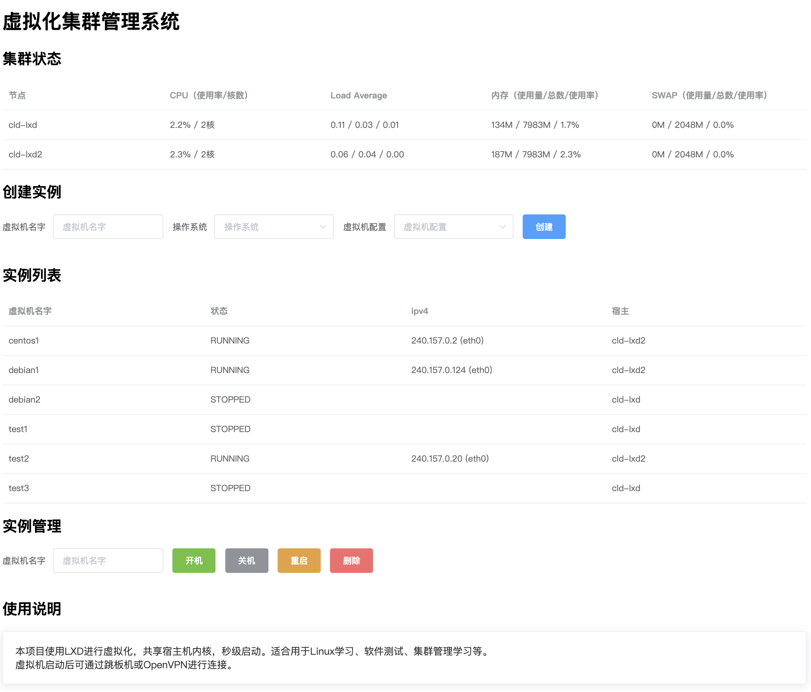

# 部署文档

## 环境部署

至少需要两台机器 ，推荐使用Ubuntu系统，安装LXD环境方便。安装好LXD之后配置LXD的Cluster（如果不配置，可以使用本项目的alone模式，在main.py中修改）。

选择其中一台为管理机，git clone 本项目。在所有节点需要创建一个新用户（用于远程管理），此处以cloud用户为例。

### 管理机

管理机上执行：

```bash
adduser --disabled-password cloud
su - cloud
ssh-keygen -t rsa
```

记住管理机的公钥：`cat /home/cloud/.ssh/id_rsa.pub`

### 所有节点

在其它机器上执行：

```bash
adduser --disabled-password cloud
su - cloud
mkdir ~/.ssh
chmod 700 ~/.ssh
touch ~/.ssh/authorized_keys
chmod 600 ~/.ssh/authorized_keys
```

修改`~/.ssh/authorized_keys`的内容为管理机的`id_rsa.pub`文件内容。

root用户执行`visudo`，添加下面这行，使得cloud用户无需密码即可sudo。

```
cloud    ALL=(ALL)       NOPASSWD: ALL
```

## 测试

确保管理机的`cloud`用户能免密码ssh到所有节点（包括管理机自身）。

确保所有机器的`cloud`用户能免密码sudo。

## 配置

修改`main.py`，修改`MODE`、`SSH_PORT`、`server_list`、`users`等参数。

## 运行

`python3 main.py`

然后访问对应端口即可使用。

# 镜像模板制作

官方镜像没有开启ssh，我们需要自制一个镜像，配置好ssh和账号密码，这样我们创建好实例后就可以直接远程连接。

推荐阅读：https://linux.cn/article-8107-1.html

当前版本，启动镜像的名字需要在前端页面(index.html)进行修改。实例配置也是。这样会存在被攻击的可能性，将于后面的版本修复。

# 截图


